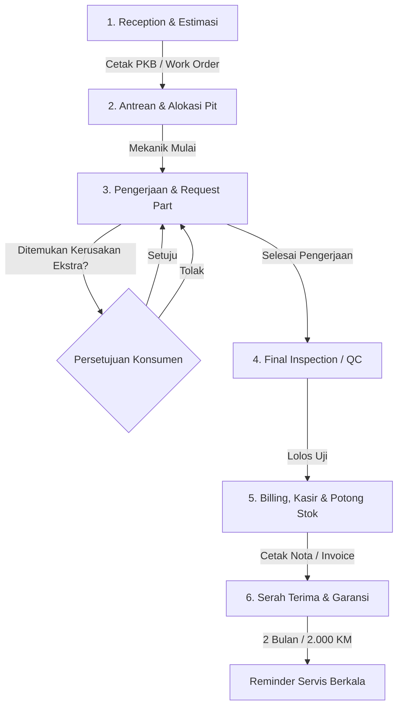

# Motorcycle Workshop (Bengkel Motor) Business Domain & SOP Skill

This skill contains the complete domain knowledge, operational flows, business rules, and best practices modeled after professional motorcycle workshops (AHASS, Yamaha SIP/Plaza, and independent modern workshops).

---

## 1. End-to-End Operational Lifecycle (6-Stage SOP)

A professional motorcycle workshop operates across 6 distinct lifecycle stages:



---

### Tahap 1: Penerimaan (Reception) & Diagnosa Awal
* **Pelaku**: *Service Advisor (SA)* atau Kasir / Frontdesk.
* **Prosedur**:
  1. Menyapa konsumen dan mencatat data identitas: Nama, No. WhatsApp/Telepon, Nomor Polisi (Nopol), Odometer/KM motor saat ini, level bahan bakar, dan keluhan utama.
  2. Pengecekan visual awal (kondisi bodi, lampu, rem, ban).
  3. Mendiagnosa paket servis yang direkomendasikan (misal: Servis Ringan / Lengkap / Ganti Oli / Tune-Up / Ganti Kampas).
  4. Memberikan **Estimasi Biaya & Estimasi Waktu Pengerjaan** kepada konsumen.
  5. Menghasilkan dokumen **PKB (Perintah Kerja Bengkel) / Work Order (WO)**.

---

### Tahap 2: Antrean & Alokasi Pit Kerja
* **Pelaku**: *Kepala Bengkel / SA*.
* **Prosedur**:
  1. Motor masuk ke antrean *Pit* pengerjaan berdasarkan urutan kedatangan (*First-Come-First-Serve*) atau prioritas *Booking/Reservasi*.
  2. Penugasan teknisi/mekanik disesuaikan dengan jenis pekerjaan (Servis Cepat / Tune Up vs Turun Mesin / Kelistrikan Berat).
  3. Status order berubah dari `MENUNGGU` menjadi `DIKERJAKAN`.

---

### Tahap 3: Pengerjaan & Permintaan Sparepart (*Part Requisition*)
* **Pelaku**: Mekanik, Petugas Gudang (*Partman*), dan SA.
* **Prosedur**:
  1. Mekanik membongkar dan memeriksa komponen sesuai PKB.
  2. Jika diperlukan suku cadang baru (oli, kampas, filter, vanbelt, busi), mekanik membuat permintaan part ke gudang.
  3. **CRITICAL BUSINESS RULE (Persetujuan Konsumen / Additional Repair Approval)**:
     - Jika mekanik menemukan komponen aus/rusak lain di luar keluhan awal yang biayanya menambah total estimasi, **SA WAJIB menghubungi konsumen terlebih dahulu untuk persetujuan (Approval)** sebelum part dipasang.
     - Part pengganti tidak boleh dipasang tanpa persetujuan konsumen.

---

### Tahap 4: Pemeriksaan Akhir (*Final Inspection / Quality Control*)
* **Pelaku**: *Kepala Mekanik / SA*.
* **Prosedur**:
  1. Melakukan uji fungsi (starter, lampu, rem depan/belakang, respon gas, stasioner).
  2. Uji jalan (*test ride*) singkat jika diperlukan (terutama untuk servis rem, transmisi CVT, atau mesin).
  3. Menyiapkan **suku cadang bekas/lama** untuk diserahkan kembali kepada konsumen sebagai bukti transparansi penggantian part.
  4. Status order berubah menjadi `SELESAI_PENGERJAAN` / `MENUNGGU_PEMBAYARAN`.

---

### Tahap 5: Kasir, Penagihan & Pengurangan Stok Otomatis
* **Pelaku**: Kasir.
* **Prosedur**:
  1. Mengonversi data PKB menjadi **Invoice / Nota Pembayaran**.
  2. Kalkulasi total: `(Total Jasa Servis) + (Total Sparepart) - (Diskon/Voucher) + (PPN jika ada)`.
  3. Penerimaan pembayaran: Tunai, Transfer Bank, QRIS, Kartu Debit, atau Piutang/Tempo (untuk pelanggan armada/korporasi).
  4. **Pengurangan Stok Otomatis**: Sistem secara atomik memotong stok suku cadang di database dan mencatat riwayat kartu stok keluar.
  5. Pencetakan Invoice rangkap (untuk konsumen dan arsip kasir). Status transaksi: `LUNAS`.

---

### Tahap 6: Serah Terima, Garansi Servis & Follow-Up
* **Pelaku**: SA & Kasir.
* **Prosedur**:
  1. Penyerahan kunci motor, nota lunas, dan part bekas kepada konsumen.
  2. Penjelasan masa **Garansi Servis**:
     - Servis Ringan / Rutin: Garansi 7 hari atau 500 km.
     - Servis Berat / Turun Mesin: Garansi 30 hari atau 1.000 km.
  3. Penjadwalan **Reminder Servis Berkala**: Sistem mencatat estimasi jadwal servis berikutnya (misal: 2 bulan ke depan atau +2.000 KM) untuk dikirimkan notifikasi WhatsApp/SMS otomatis.

---

## 2. Business Rules & Logic Matrix

### 2.1 Aturan Kendaraan & Pelanggan
1. **Unisitas Nopol**: Nomor Polisi (`nopol`) motor bersifat unik secara fisik.
2. **Relasi Histori Servis**: Riwayat servis kendaraan terikat pada ID Kendaraan (`vehicle_id`), bukan semata ID Pelanggan, agar jika motor berpindah tangan, riwayat perawatan mesin tetap utuh.
3. **Pencatatan Odometer (KM)**: KM motor selalu naik monoton (`current_km >= last_km`).

### 2.2 Aturan Manajemen Inventaris & Sparepart
1. **Kategori Fast Moving vs Slow Moving**:
   - *Fast Moving*: Oli mesin/gardan, kampas rem, busi, air radiator, filter udara, lampu bohlam (wajib stok tinggi & restock cepat).
   - *Slow Moving*: Piston kit, klep, spul, CDI/ECU, shockbreaker, rantai keteng.
2. **Reorder Point (ROP)**: Ketika `stok <= min_stok` (misal 5 unit), sistem menandai status *Stok Menipis* dan menyarankan purchase order ke supplier.
3. **Larangan Stok Negatif**: Transaksi penjualan/pemasangan part tidak boleh diproses jika kuantitas melebihi stok yang tersedia (`qty <= current_stock`).
4. **Metode Penilaian Persediaan**: Menggunakan FIFO (*First-In, First-Out*) atau Average Cost untuk melacak Harga Pokok Penjualan (HPP).

### 2.3 Aturan Komisi & Insentif Mekanik
1. **Skema Komisi Umum**:
   - **Bagi Hasil Jasa**: Persentase dari total biaya jasa servis yang diselesaikan (contoh: 50% Mekanik, 50% Bengkel, atau 60:40).
   - **Nominal Flat per Jasa**: Nilai rupiah pasti per jenis pekerjaan (contoh: Ganti Oli Rp 5.000, Servis Lengkap Rp 30.000, Turun Mesin Rp 75.000).
2. **Klausul Garansi & Retur Pengerjaan**: Jika konsumen mengajukan klaim garansi dalam masa garansi akibat kelalaian pemasangan mekanik, perbaikan ulang dilakukan tanpa tambahan komisi baru.

---

## 3. Recommended Database Schema / Entities

| Entitas | Deskripsi | Atribut Kunci |
| :--- | :--- | :--- |
| `Customer` | Data pemilik/pelanggan | `id, nama, no_hp, alamat, created_at` |
| `Vehicle` | Data unit motor | `id, customer_id, nopol, brand_id, type_id, capacity_id, jenis, km_terakhir` |
| `MotorBrand & MotorType` | Master merk & tipe motor | `id, nama, brand_id` |
| `ServiceMaster` | Katalog jasa servis & tarif | `id, nama, tarif, deskripsi, komisi_mekanik, is_active` |
| `Mechanic` | Data teknisi bengkel | `id, nama, no_hp, waktu_kerja, persentase_bagi_hasil, is_active` |
| `Sparepart` | Katalog suku cadang | `id, kode_part, nama, stok, min_stok, hpp, harga_jual, supplier_id` |
| `WorkOrder (Service)` | Dokumen PKB / Antrean Servis | `id, nomor_pkb, vehicle_id, mechanic_id, sa_id, km_masuk, keluhan, status, tgl_masuk, tgl_selesai` |
| `WorkOrderItem` | Rincian jasa & part per PKB | `id, work_order_id, tipe_item (JASA/PART), item_id, qty, harga_satuan, subtotal` |
| `StockMovement` | Kartu stok (in, out, opname) | `id, sparepart_id, jenis (IN/OUT/ADJUST), qty, referensi_id, created_at` |
| `Invoice` | Tagihan & pembayaran kasir | `id, no_invoice, work_order_id, total_jasa, total_part, diskon, total_akhir, status_bayar, metode_bayar, tgl_bayar` |

---

## 4. Status Transition State Machine

```text
[DRAFT / MENUNGGU] 
       │ (Mekanik di-assign & mulai kerja)
       ▼
  [DIKERJAKAN]
       │ (Mekanik menemukan kerusakan tambahan)
       ├─────────────────────────────────────────► [MENUNGGU_KONFIRMASI]
       │                                                    │ (Konsumen Menyetujui/Menolak)
       │◄───────────────────────────────────────────────────┘
       │ (Pekerjaan fisik selesai)
       ▼
 [FINAL_INSPECTION]
       │ (Lulus QC)
       ▼
[MENUNGGU_PEMBAYARAN]
       │ (Kasir memproses bayar)
       ▼
    [LUNAS]
       │ (Jika terjadi retur / komplain garansi)
       ▼
[KLAIM_GARANSI]
```
