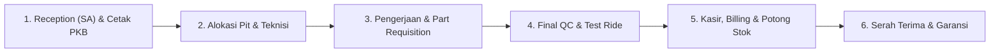

# 🏍️ BengkelKu - Enterprise Workshop Management System

**BengkelKu** adalah sistem Enterprise Resource Planning (ERP) dan manajemen operasional bengkel sepeda motor modern berbasis **Vue 3, Express.js, Prisma ORM, dan MySQL (3NF Normalized)**. 

Aplikasi ini dirancang mengikuti **Standard Operating Procedure (SOP) Bengkel Otomotif Resmi** (AHASS, Yamaha, dsb) untuk menghubungkan peran Service Advisor (SA), Kepala Bengkel, Teknisi/Mekanik, Petugas Gudang (*Partman*), dan Kasir dalam satu alur kerja yang terintegrasi dan akuntabel.

---

## 🚀 Alur Operasional Bengkel (End-to-End Workflow)

Sistem mengadopsi 6 tahapan siklus layanan bengkel standar industri:



### 1. Tahap 1: Penerimaan (Reception) & Penerbitan PKB
* **Petugas**: *Service Advisor (SA)* / Frontdesk.
* **Fitur & Prosedur**:
  - Auto-lookup data riwayat kendaraan berdasarkan Nomor Polisi (Nopol).
  - Pemilihan Merk (Pill selector), Tipe Motor (dengan badge jenis transmisi Matic/Bebek/Sport), dan Kapasitas Mesin (cc).
  - Checklist inspeksi fisik (KM Odometer, indikator level bensin visual, catatan fisik & barang bawaan).
  - Diagnosa keluhan pelanggan dan rekomendasi paket jasa servis (*Service Master*).
  - Cetak dokumen resmi **Perintah Kerja Bengkel (PKB) / Work Order** (Format A4 Monokrom Resmi dengan Surat Kuasa & 3 Kolom Tanda Tangan).
  - **Aturan Bisnis**: Status awal servis selalu strictly **`Menunggu`**.

### 2. Tahap 2: Alokasi Pit & Penugasan Teknisi Pelaksana
* **Petugas**: Kepala Bengkel / Service Advisor.
* **Fitur & Prosedur**:
  - Modal interaktif alokasi Pit Kerja (`Pit 1 - General`, `Pit 2 - Regular & CVT`, `Pit 3 - Quick Service`, `Pit 4 - Heavy Repair`).
  - Penugasan teknisi dengan status ketersediaan *real-time* (🟢 *Standby* vs 🔵 *Bekerja*).
  - **Validasi Bisnis 1 (Mekanik Sibuk)**: Mencegah alokasi ke mekanik yang sedang aktif mengerjakan motor lain tanpa persetujuan eksplisit.
  - **Validasi Bisnis 2 (Pengalihan Pilihan Pelanggan)**: Konfirmasi SweetAlert2 jika mekanik yang dipilih dialihkan dari permintaan awal konsumen saat reception.
  - Transisi status: **`Menunggu` ➔ `Dikerjakan`**.

### 3. Tahap 3: Pengerjaan & Permintaan Suku Cadang (*Part Requisition*)
* **Petugas**: Teknisi & Petugas Gudang (*Partman*).
* **Fitur & Prosedur**:
  - Pengerjaan unit sesuai instruksi keluhan pada lembar PKB.
  - Pengambilan suku cadang (*sparepart*) yang dibutuhkan.
  - Konfirmasi persetujuan konsumen (*customer approval*) jika ditemukan kerusakan ekstra di luar keluhan awal.

### 4. Tahap 4: Pemeriksaan Akhir (*Final Inspection / QC*)
* **Petugas**: Kepala Mekanik / SA.
* **Fitur & Prosedur**:
  - Uji fungsi pengereman, kelistrikan, dan uji jalan (*road test*).
  - Pengumpulan suku cadang bekas sebagai bukti fisik penggantian untuk konsumen.
  - Transisi status: **`Dikerjakan` ➔ `Selesai` (Siap Masuk Billing/Kasir)**.

### 5. Tahap 5: Kasir, Billing & Pemotongan Stok
* **Petugas**: Kasir / Finance.
* **Fitur & Prosedur**:
  - Pembuatan Invoice otomatis dengan penggabungan biaya jasa servis + suku cadang yang digunakan.
  - Pemilihan multi-metode pembayaran (Tunai, Transfer Bank, QRIS).
  - Pemotongan stok gudang secara otomatis dan pencatatan riwayat transaksi.

### 6. Tahap 6: Serah Terima & Garansi Servis
* **Petugas**: Kasir / SA.
* **Fitur & Prosedur**:
  - Penyerahan kunci, unit kendaraan, dan sparepart bekas kepada konsumen.
  - Penjelasan kartu garansi servis dan pengingat servis berkala berikutnya (*Service Reminder*).

---

## 🛠️ Arsitektur & Tech Stack

### Frontend
- **Framework**: Vue 3 (Composition API, `<script setup>`) + Vite.
- **Styling**: Vanilla CSS ERP Design System (Scoped CSS, High-Contrast Typography, JetBrains Mono Tabular Figures).
- **Icons & Dialogs**: Phosphor Icons, SweetAlert2.
- **Arsitektur Modular Composables**:
  - `src/utils/api.js`: Centralized HTTP REST Client.
  - `src/utils/swal.js`: SweetAlert2 custom ERP theme mixins.
  - `src/utils/formatters.js`: Currency (IDR), format tanggal & label motor.
  - `src/composables/useUiState.js`: Navigasi & global toast state.
  - `src/composables/useMasterData.js`: State & CRUD data master.
  - `src/composables/useQueueService.js`: State antrean PKB, Reception & Alokasi Pit (Tahap 1 & 2).
  - `src/composables/useTransactions.js`: Billing, kasir, invoice & stok masuk.
  - `src/composables/useBengkelApp.js`: Facade aggregator terpadu.

### Backend
- **Runtime**: Node.js & Express.js.
- **ORM & Database**: Prisma ORM dengan MySQL Database (Normalisasi 3NF/BCNF).
- **Dokumentasi API**: OpenAPI 3.0 & Swagger UI (`http://localhost:3333/api-docs`).
- **Pola Arsitektur**: Controller-Service-Repository dengan Centralized Async Error Handling.

---

## 🗄️ Struktur Database (3NF Normalized)

- **`MotorBrand`**: Master merk motor (`Honda`, `Yamaha`, `Suzuki`, `Kawasaki`, `Vespa`).
- **`MotorType`**: Master model/tipe motor berelasi ke brand (`Beat`, `Vario`, `NMAX`, `Aerox`, `PCX`, dll).
- **`EngineCapacity`**: Master kapasitas mesin (`110cc`, `125cc`, `150cc`, `155cc`, `160cc`, `250cc`).
- **`Customer`**: Data pemilik kendaraan unik berdasarkan nomor telepon.
- **`Vehicle`**: Data spesifikasi kendaraan fisik unik berdasarkan Nomor Polisi (Nopol).
- **`ServiceMaster`**: Master paket jasa servis & estimasi biaya/durasi standar.
- **`Mechanic`**: Data teknisi, spesialisasi keahlian, dan status ketersediaan.
- **`Supplier`**: Pemasok distributor suku cadang resmi.
- **`Sparepart`**: Master suku cadang, stok gudang, harga beli, harga jual, dan batas *minimum stock*.
- **`Service`**: Entitas transaksi servis & nomor PKB resmi (`PKB-YYYYMMDD-XXX`).
- **`Transaction` & `TransactionItem`**: Riwayat billing, pembayaran kasir, dan detail item suku cadang/jasa.

---

## ⚙️ Panduan Instalasi & Menjalankan Aplikasi

### 1. Prasyarat
- Node.js versi 18 atau lebih tinggi.
- MySQL Server aktif pada port `3333` / `3306`.

### 2. Konfigurasi Environment Backend
Sesuaikan file `backend/.env`:
```env
DATABASE_URL="mysql://root:@localhost:3306/bengkel"
PORT=3333
```

### 3. Instalasi Dependensi & Migrasi Database
```bash
# Terminal 1 - Backend
cd backend
npm install
npx prisma migrate dev --name init_workshop_db

# Terminal 2 - Frontend
cd frontend
npm install
```

### 4. Menjalankan Aplikasi
```bash
# Jalankan Backend API Server (Port 3333)
cd backend
npm run dev

# Jalankan Frontend Development Server (Port 8080)
cd frontend
npm run dev
```

Akses aplikasi di browser:
- **Frontend App**: `http://localhost:8080`
- **Backend API**: `http://localhost:3333`
- **Dokumentasi Swagger API**: `http://localhost:3333/api-docs`

---

## 📋 Endpoint API Utama

| Method | Endpoint | Deskripsi |
| :--- | :--- | :--- |
| **GET** | `/api/master/brands` | Mengambil seluruh master merk motor |
| **GET** | `/api/master/types?brandId=...` | Mengambil tipe motor berdasarkan merk terpilih |
| **GET** | `/api/master/capacities` | Mengambil daftar kapasitas mesin |
| **GET/POST/PUT/DELETE** | `/api/master/service-masters` | CRUD master paket jasa servis |
| **GET/POST/PUT/DELETE** | `/api/master/spareparts` | CRUD master suku cadang & stok |
| **GET/POST/PUT/DELETE** | `/api/master/suppliers` | CRUD master pemasok / supplier |
| **GET/POST/PUT/DELETE** | `/api/mechanics` | CRUD master teknisi / mekanik |
| **GET** | `/api/vehicles/search?nopol=...` | Pencarian auto-lookup data kendaraan |
| **GET** | `/api/services` | Mengambil seluruh antrean servis / PKB |
| **POST** | `/api/services` | Registrasi PKB baru (Reception Tahap 1) |
| **PATCH** | `/api/services/:id/status` | Alokasi Pit & Penugasan Teknisi (Tahap 2) & Update Status |
| **POST** | `/api/transactions` | Proses pembayaran kasir & cetak invoice (Tahap 5) |

---

## 📄 Lisensi & Hak Cipta
Dikembangkan untuk sistem manajemen operasional bengkel motor modern berstandar enterprise.
