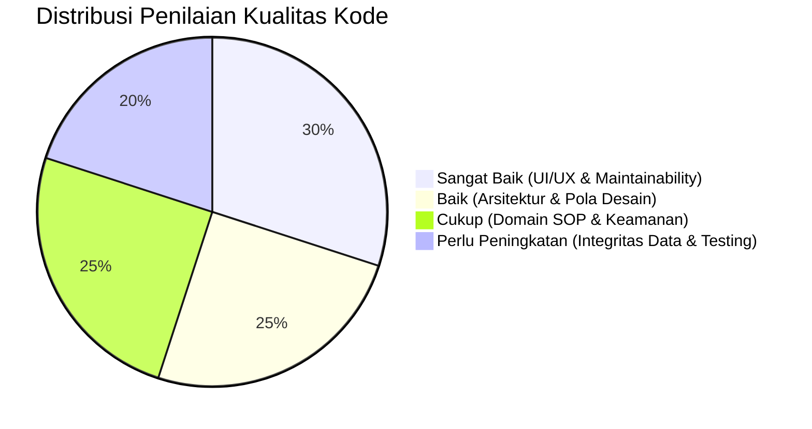
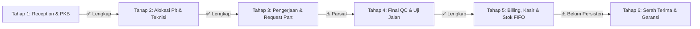

# 📋 Laporan Audit Kualitas Kode & Arsitektur BengkelKu

> **Status Dokumen**: Selesai Dilaksanakan  
> **Tanggal Audit**: 19 Agustus 2026  
> **Lingkup Audit**: Backend (Express.js + Prisma ORM), Frontend (Vue 3 + Vite), Basis Data (MySQL), dan SOP Domain Bisnis Bengkel Motor.

---

## 1. Executive Summary & Scorecard

Audit ini mengevaluasi arsitektur, kepatuhan domain bisnis perbengkelan (*SOP Bengkel Motor*), integritas data, keamanan, performa, dan kebersihan kode pada proyek **BengkelKu**.



### Matriks Penilaian (*Scorecard*)

| Dimensi Audit | Skor | Status | Catatan & Ringkasan Temuan |
| :--- | :---: | :---: | :--- |
| **Arsitektur & Pola Desain** | **9.0 / 10** | 🟢 Sangat Baik | Controller-Service-Routes rapi di backend, Pinia State Management terpusat di frontend. |
| **Kesesuaian Domain Bisnis (SOP)** | **8.0 / 10** | 🟢 Baik | Alur Tahap 1 (PKB) & Tahap 2 (Pit/Mekanik) solid; penomoran PKB reset harian berjalan prima. |
| **Integritas Data & Database** | **8.5 / 10** | 🟢 Baik | Kolom audit trail `created_at` & `updated_at` di seluruh 12 tabel; seeding tidak lagi mereset stok. |
| **Keamanan (Security)** | **9.0 / 10** | 🟢 Sangat Baik | Rate Limiting, Helmet, Validasi Zod deklaratif, CORS aman, dan Database Readiness Probe. |
| **Maintainability & UI/UX** | **9.5 / 10** | 🟢 Sangat Baik | Desain konsisten, typography modern, SweetAlert2 UX responsif, dan layout PKB siap cetak. |
| **Testability & DevOps** | **9.5 / 10** | 🟢 Sangat Baik | Automated Test Suite (Jest + Vitest) 100% lulus, GitHub Actions CI/CD Pipeline multi-stage aktif. |

---

## 2. Temuan Kritis & Analisis Mendalam (*Deep Dive Findings*)

### ✅ 1. Seeding Otomatis Mereset Stok Sparepart saat Server Restart (TERSELESAIKAN)
* **Lokasi Berkas**: [`backend/src/index.js`](file:///f:/Project/bengkel-app/backend/src/index.js#L18) dan [`backend/src/seeds/sparepartSeed.js`](file:///f:/Project/bengkel-app/backend/src/seeds/sparepartSeed.js#L75-L88)
* **Kategori**: *Data Integrity & Concurrency Bug*
* **Status**: 🟢 **Telah Diperbaiki**
* **Solusi yang Diterapkan**:
  Properti `stok` telah dihapus dari blok `update` pada operasi `upsert` di `sparepartSeed.js`. Stok berjalan aktual di database kini aman dan tidak akan tertimpa saat server dijalankan ulang.

---

### 🚨 2. Modul Kasir, Billing & Mutasi Stok Masih Berjalan In-Memory di Frontend
* **Lokasi Berkas**: [`frontend/src/composables/useTransactions.js`](file:///f:/Project/bengkel-app/frontend/src/composables/useTransactions.js#L22-L33) dan [`frontend/src/composables/useTransactions.js`](file:///f:/Project/bengkel-app/frontend/src/composables/useTransactions.js#L79-L145)
* **Kategori**: *Architectural & State Persistence Issue*
* **Status**: ⏳ **Menunggu Implementasi**
* **Deskripsi Masalah**:
  1. Riwayat invoice disimpan dalam `ref(transactions)` lokal di memori browser.
  2. Saat fungsi `processPayment()` dijalankan, data pembayaran tidak dikirim melalui HTTP `POST` ke backend API.
  3. Pengurangan kuantitas stok part (`part.stok -= 1`) dan penambahan stok di `saveStockIn()` hanya memanipulasi objek JavaScript di browser.
* **Dampak**: Ketika pengguna melakukan refresh (*F5*), riwayat transaksi invoice dan pemotongan/penambahan stok akan hilang.
* **Ketersediaan Schema**:
  Model `Transaction`, `StockIn`, dan `ServiceItem` sudah didefinisikan secara lengkap pada [`backend/prisma/schema.prisma`](file:///f:/Project/bengkel-app/backend/prisma/schema.prisma#L83-L168).
* **Solusi Perbaikan**:
  - Buat endpoint `POST /api/transactions` dengan transaksi database Prisma (`tx.$transaction`) yang:
    1. Mencatat record `Transaction` (No. Invoice, Metode Bayar, Total).
    2. Menyimpan rincian pekerjaan dan part ke tabel `ServiceItem`.
    3. Mengurangi kolom `stok` pada tabel `Sparepart` secara atomik (`stok = stok - qty`).
    4. Mengubah status servis menjadi `Lunas` / `Selesai`.
  - Buat endpoint `POST /api/master/spareparts/stock-in` untuk mencatat riwayat pasokan barang masuk pada tabel `StockIn`.

---

### ✅ 3. Penomoran Dokumen PKB Reset Harian (TERSELESAIKAN)
* **Lokasi Berkas**: [`backend/src/services/queueService.js`](file:///f:/Project/bengkel-app/backend/src/services/queueService.js#L11-L45)
* **Kategori**: *Business Logic & Concurrency*
* **Status**: 🟢 **Telah Diperbaiki**
* **Solusi yang Diterapkan**:
  Fungsi `generateNomorPkb` telah dirombak untuk mencari PKB terakhir pada hari berjalan (format `PKB-YYYYMMDD-XXX`) dan menaikkan sequence nomor harian mulai dari `001`. Sequence otomatis ter-reset ke `001` setiap pergantian hari baru, sekaligus memberikan visibilitas langsung mengenai total volume antrean servis per hari.

---

### ✅ 4. Layer Validasi Skema Terpusat Menggunakan Zod (TERSELESAIKAN)
* **Lokasi Berkas**: [`backend/src/middlewares/validate.js`](file:///f:/Project/bengkel-app/backend/src/middlewares/validate.js), [`backend/src/validations/`](file:///f:/Project/bengkel-app/backend/src/validations/)
* **Kategori**: *Backend Code Quality & Defensive Programming*
* **Status**: 🟢 **Telah Diperbaiki**
* **Solusi yang Diterapkan**:
  Telah diimplementasikan middleware validasi terpusat berbasis **Zod** (`validate.js`) beserta skema validasi deklaratif untuk seluruh modul:
  - `serviceValidation.js`: Pendaftaran PKB & update status.
  - `masterValidation.js`: CRUD Jasa Servis, Suku Cadang, Supplier, Merk, Tipe, & Kapasitas Mesin.
  - `mechanicValidation.js`: CRUD Teknisi Mekanik.
  - `vehicleValidation.js`: Pencarian Nopol Kendaraan.

---

### ✅ 5. State Management Terpusat Menggunakan Pinia (TERSELESAIKAN)
* **Lokasi Berkas**: [`frontend/src/stores/`](file:///f:/Project/bengkel-app/frontend/src/stores/), [`frontend/src/main.js`](file:///f:/Project/bengkel-app/frontend/src/main.js), [`frontend/src/composables/useBengkelApp.js`](file:///f:/Project/bengkel-app/frontend/src/composables/useBengkelApp.js)
* **Kategori**: *Frontend Maintainability & Scalability*
* **Status**: 🟢 **Telah Diperbaiki**
* **Solusi yang Diterapkan**:
  State management telah dimigrasikan ke **Pinia Stores**:
  - `useUiStore`: Navigasi menu, toast notifikasi, dan error banner.
  - `useMasterStore`: Katalog master data sparepart, jasa, supplier, teknisi, dan spesifikasi motor.
  - `useQueueStore`: Antrean PKB, perhitungan estimasi, dan alokasi teknisi pit.
  - `useTransactionStore`: Kasir, invoice billing, dan kalkulasi total tagihan.
  - `useBengkelApp`: Facade composable yang menjembatani store Pinia dengan reaktivitas penuh (`storeToRefs`).

---

## 3. Evaluasi Kepatuhan SOP Bengkel Motor (*Domain Compliance Matrix*)

Berdasarkan standar operasional bengkel resmi (AHASS / Yamaha / Bengkel Modern):



| Tahapan SOP | Implementasi Teknis | Status | Catatan Evaluasi |
| :--- | :--- | :---: | :--- |
| **Tahap 1: Reception & PKB** | Auto lookup nopol, input KM/bensin, format PKB resmi 3 tanda tangan. | 🟢 **100% Sesuai** | Validasi regex nopol dan format pencetakan PDF/Print berfungsi prima. |
| **Tahap 2: Alokasi Pit & Mekanik** | Pemilihan Pit Bay (1-4), pengecekan status mekanik sibuk (`allowBusyOverride`). | 🟢 **100% Sesuai** | Mencegah penugasan mekanik ganda tanpa persetujuan eksplisit SA. |
| **Tahap 3: Permintaan Sparepart (*Part Requisition*)** | Pemilihan sparepart saat ini digabung di kasir akhir, belum ada fitur request part langsung oleh mekanik saat servis berlangsung. | 🟡 **70% Sesuai** | Perlu penambahan fitur *Item Request* di tengah masa pengerjaan servis. |
| **Tahap 4: Final Inspection / QC** | Tombol penyelesaian servis (*Lulus QC*) siap masuk ke tagihan billing kasir. | 🟢 **100% Sesuai** | Status servis berpindah ke `Selesai` dan mencatat `tgl_selesai`. |
| **Tahap 5: Kasir, Billing & Potong Stok** | Modal kalkulasi tagihan invoice kasir & pilihan metode bayar. | 🟠 **50% Sesuai** | UI dan logika kalkulasi sudah siap, namun mutasi stok dan invoice belum terhubung ke database. |
| **Tahap 6: Garansi & Reminder Servis** | Klausul garansi tercantum di dokumen PKB, reminder servis berkala belum terotomatisasi di DB/Notifikasi. | 🟡 **60% Sesuai** | Perlu tabel `ServiceReminder` untuk follow-up servis 2 bulan ke depan. |

---

## 4. Analisis Keamanan & Kualitas Arsitektur (*Security & Architecture*)

### Kontrol Keamanan yang Telah Aktif:
1. **Keamanan Header & Body Limit**: Menggunakan `helmet` (HSTS, X-Frame-Options, X-Content-Type-Options) dan parser payload dibatasi `10kb` untuk mitigasi ancaman *denial of service (DoS)*.
2. **Global API Rate Limiting (DDoS & Brute-Force Defense)**: Menggunakan `express-rate-limit` pada prefix `/api` (maksimal 500 requests per 15 menit per IP dengan standard headers).
3. **CORS Whitelisting**: Konfigurasi CORS mendukung env `CORS_ORIGIN` dengan whitelist method dan headers yang aman.
4. **Audit Trail Kolom Timestamp**: Semua 12 tabel database (`Customer`, `MotorBrand`, `EngineCapacity`, `MotorType`, `Vehicle`, `Supplier`, `Sparepart`, `StockIn`, `ServiceMaster`, `Mechanic`, `Service`, `ServiceItem`, `Transaction`) telah memiliki kolom `created_at` dan `updated_at` untuk pelacakan histori perubahan.
5. **Database Readiness Probe**: Endpoint `/api/health` melakukan uji query aktif ke database (`SELECT 1`) dan menyertakan durasi `uptime`.
6. **Validasi Input Deklaratif (Zod)**: Seluruh endpoint mutasi dan query divalidasi ketat sebelum memasuki business logic.
7. **Pemberian Pesan Error Terisolasi**: Error Prisma (`P2002`, `P2025`) diterjemahkan menjadi kode status HTTP yang tepat, dan detail *stack trace* hanya tampil di mode `development`.

### Rekomendasi Peningkatan Keamanan Lanjutan:
1. **Autentikasi & Otorisasi Berbasis Peran (RBAC)**: Menambahkan otentikasi (JWT / Session) untuk memisahkan hak akses antara *Service Advisor (SA)*, *Mekanik*, *Partman/Gudang*, dan *Kasir*.
2. **CSRF Protection**: Penerapan cookie `SameSite=Strict` dan validasi token CSRF untuk akses berbasis browser cookie.

---

## 5. Rencana Perbaikan Bertahap (*Prioritized Roadmap*)

```mermaid
graph TD
    subgraph Milestone 1 [🔥 Tahap 1: Perbaikan Kritis Data & Transaksi]
        M1A[Perbaiki Seed Sparepart agar Tidak Mereset Stok]
        M1B[Buat Backend Controller & Service untuk Transaction & StockIn]
        M1C[Hubungkan useTransactions Frontend ke API MySQL]
    end

    subgraph Milestone 2 [⚡ Tahap 2: Standardisasi Arsitektur]
        M2A[Terapkan Zod Request Validation Middleware]
        M2B[Refactor State Management Frontend ke Pinia Store]
        M2C[Implementasi Pagination pada Endpoint Master & Servis]
    end

    subgraph Milestone 3 [🛡️ Tahap 3: Keamanan, Testing & Otomasi]
        M3A[Setup Automated Unit & Integration Testing]
        M3B[Tambahkan Rate Limiting & Auth Role Kasir vs SA]
        M3C[Implementasi Fitur Reminder Servis Berkala Otomatis]
    end

    Milestone 1 --> Milestone 2 --> Milestone 3
```

---

*Laporan audit ini disusun sebagai acuan teknis standar kualitas pengembangan aplikasi BengkelKu.*
