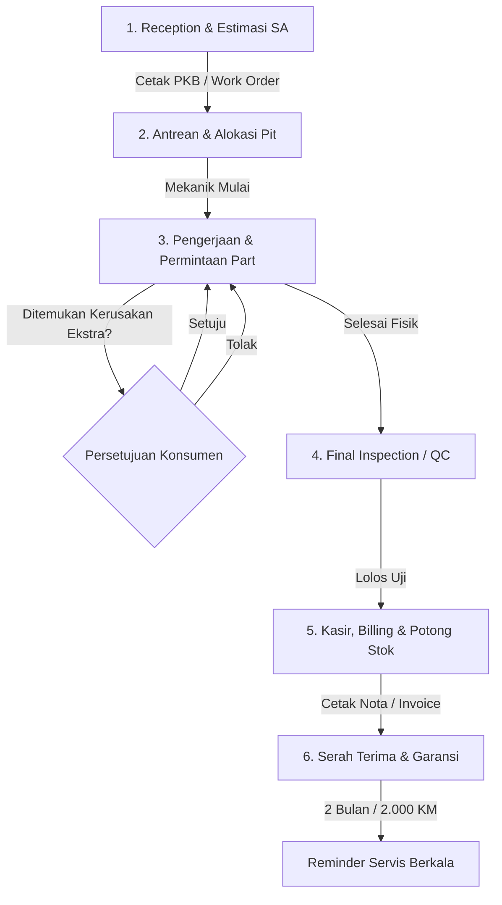

# Motorcycle Workshop (Bengkel Motor) Business Flow & SOP

Dokumen ini mendeskripsikan alur kerja operasional, Standar Operasional Prosedur (SOP), aturan bisnis (*business rules*), dan interaksi antarmodul dalam sistem **BengkelKu** yang diadopsi dari tata kelola bengkel motor profesional (AHASS, Yamaha SIP/Plaza, & bengkel modern).

---

## 1. Diagram Alur Operasional Utama (6-Stage End-to-End SOP)

---

## 2. Rincian Alur per Tahapan Operasional

### A. Tahap 1: Penerimaan (Reception) & Pembuatan PKB
* **Petugas**: *Service Advisor (SA)* / Frontdesk.
* **Prosedur**:
  1. Input identitas pelanggan (Nama, WhatsApp) & kendaraan (Nomor Polisi unik, Odometer/KM motor, level bensin).
  2. Diagnosa keluhan dan rekomendasi paket servis (Servis Ringan, Servis Lengkap, Ganti Oli, dll).
  3. Pembuatan dokumen **PKB (Perintah Kerja Bengkel) / Work Order (WO)** yang memuat rincian estimasi biaya dan estimasi waktu.

### B. Tahap 2: Alokasi Pit & Penugasan Mekanik
* **Petugas**: Kepala Bengkel / SA.
* **Prosedur**:
  1. Alokasi antrean motor ke *Pit* kerja berdasarkan urutan kedatangan atau jadwal reservasi.
  2. Penugasan teknisi yang sesuai. Status order: `MENUNGGU` ➔ `DIKERJAKAN`.

### C. Tahap 3: Pengerjaan & Permintaan Part (*Part Requisition*)
* **Petugas**: Mekanik, Petugas Gudang (*Partman*), SA.
* **Prosedur**:
  1. Mekanik melakukan pembongkaran dan servis sesuai item di PKB.
  2. **Rule Persetujuan Tambahan (*Approval*)**: Jika ditemukan sparepart aus lain di luar keluhan awal, SA **wajib meminta persetujuan konsumen** terlebih dahulu sebelum part dipasang.

### D. Tahap 4: Pemeriksaan Akhir (*Final Inspection / QC*)
* **Petugas**: Kepala Mekanik / SA.
* **Prosedur**:
  1. Pengujian fungsi kelistrikan, rem, respon gas, dan uji jalan (*test ride*).
  2. Mengumpulkan sparepart bekas/lama untuk diserahkan ke konsumen sebagai bukti fisik penggantian.
  3. Status order: `DIKERJAKAN` ➔ `SELESAI` (Siap Bayar).

### E. Tahap 5: Kasir, Billing, Pengurangan Stok & Serah Terima Garansi
* **Petugas**: Kasir & SA.
* **Prosedur Terpadu**:
  1. **Pembuatan Invoice dari PKB**: Agregasi otomatis Total Jasa Dasar + Jasa Tambahan (Approved) + Suku Cadang (Approved) - Diskon. Format penomoran invoice resmi: `INV-YYMMDD-XXX`.
  2. **Penerimaan Pembayaran Multikanal**: Tunai (dengan validasi kembalian), Transfer Bank (BCA, Mandiri, BRI), QRIS, Piutang Armada.
  3. **Pengurangan Stok Otomatis Secara Atomik (`prisma.$transaction`)**: Kuantitas fisik suku cadang dipotong otomatis di gudang saat transaksi disimpan.
  4. **Cetak Struk Kasir & Kartu Garansi Terpadu**:
     - *Garansi Servis*: Servis Rutin (7 Hari / 500 KM) & Servis Berat / Turun Mesin (30 Hari / 1.000 KM).
     - *Next Service Reminder*: Rekomendasi servis berikutnya (+60 Hari / +2.000 KM).
     - *Pemberitahuan WhatsApp*: Tombol kirim ringkasan invoice, bukti garansi, dan pengingat servis langsung ke nomor WhatsApp konsumen.
     - *Serah Terima*: Pernyataan resmi serah terima kunci motor dan suku cadang bekas. Status transaksi: `LUNAS`.

---

## 3. Matriks Aturan Bisnis (*Business Rules*)

1. **Aturan Nomor Polisi**: Nomor Polisi (`nopol`) motor wajib unik dan menjadi kunci pelacakan histori servis jangka panjang.
2. **Aturan Stok Sparepart**:
   - Transaksi kasir tidak boleh menghasilkan stok negatif (`qty <= stok_tersedia`).
   - Suku cadang dikelompokkan ke dalam *Fast Moving* (oli, kampas, busi) dan *Slow Moving* (piston, klep, shockbreaker).
   - Ketika stok mencapai batas minimum (*Reorder Point*), sistem memberikan notifikasi *Stok Menipis*.
3. **Aturan Komisi Mekanik**:
   - Komisi dihitung dari persentase bagi hasil jasa servis atau tarif flat per jenis pekerjaan.
   - Pengerjaan ulang atas klaim garansi tidak menghasilkan komisi baru.

---

## 4. Matriks Hak Akses & Otorisasi Pengguna (Role-Based Access Control)

Sistem menerapkan 3 peran utama dengan pembatasan hak akses berbasis keamanan enterprise:

| Fitur / Modul | ADMIN / Service Advisor (SA) | MEKANIK | KEPALA BENGKEL |
| :--- | :---: | :---: | :---: |
| **Penerimaan Servis & PKB (Tahap 1)** | ✅ Penuh (CRUD) | ❌ Dibatasi | 👁️ Read-Only |
| **Alokasi Pit & Penugasan (Tahap 2)** | ✅ Penuh (Assign Mekanik) | ❌ Dibatasi | 👁️ Read-Only |
| **Pengerjaan & Permintaan Part (Tahap 3)**| ✅ Approval & Requisition | 🔧 Hanya Job Miliknya | 👁️ Read-Only |
| **Final Inspection / QC (Tahap 4)** | ✅ Selesai & Lolos QC | ❌ Dibatasi | 👁️ Read-Only |
| **Kasir, Billing & Pembayaran (Tahap 5)** | ✅ Penuh (Invoice & Bayar) | ❌ Dilarang (403) | 👁️ Read-Only |
| **Katalog & Stok Sparepart Gudang** | ✅ Penuh (Stok Masuk/Keluar) | 👁️ Cek Stok (Read-Only) | 👁️ Read-Only |
| **Manajemen Data Teknisi Mekanik** | 👁️ View & Status Kerja | ❌ Dibatasi | ✅ Penuh (CRUD + Komisi) |
| **Executive Dashboard & Rekap Bisnis** | 📊 Ringkasan Harian | ❌ Dibatasi | 📈 Rekap Omzet & Performa |
| **Manajemen Akun & Pengguna (*Users*)** | ❌ Dilarang (403) | ❌ Dilarang (403) | ✅ Penuh (CRUD User & Reset) |

---

## 5. Standar Keamanan & Manajemen Token

* **Access Token**: JWT berdurasi **5 menit**, disimpan *In-Memory* di client (Pinia) untuk mencegah pencurian via XSS.
* **Refresh Token**: Token unik berdurasi **7 hari**, disimpan di database dan dikirim via Cookie `httpOnly; Secure; SameSite=Lax`.
* **Silent Refresh**: Otomatis memperbarui Access Token di background saat mendeteksi HTTP 401 tanpa *logout* paksa bagi user yang aktif.
