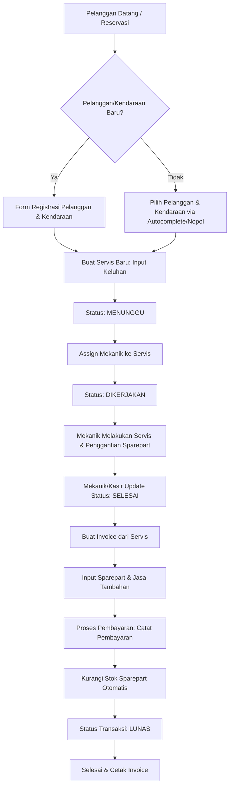
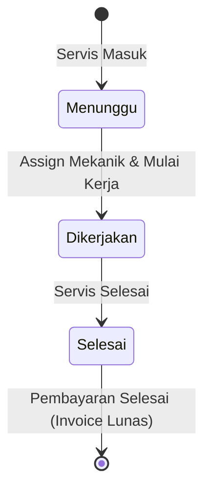

# Module Flow & Architecture: BengkelKu

Dokumen ini mendeskripsikan alur kerja antarmodul, interaksi data, dan proses bisnis utama dalam sistem **BengkelKu (MVP V1)** untuk memandu implementasi kode pada frontend dan backend.

---

## 1. Diagram Alur Utama (End-to-End User Flow)

Berikut adalah diagram alur bagaimana pelanggan masuk, diservis oleh mekanik, hingga pembayaran invoice diselesaikan oleh kasir.



---

## 2. Alur Kerja Detil per Modul

### A. Modul Servis (Service Management)
Modul ini menangani pencatatan dan pelacakan unit motor yang masuk ke bengkel.

* **Input**: Data Pelanggan, Data Kendaraan (Nomor Polisi wajib unik), Keluhan, Mekanik yang ditugaskan.
* **Proses Perubahan Status**:
  1. **MENUNGGU**: Motor terdaftar tetapi mekanik belum ditugaskan atau belum mulai bekerja.
  2. **DIKERJAKAN**: Mekanik mulai mengerjakan servis.
  3. **SELESAI**: Pekerjaan mekanik selesai, siap untuk dibuatkan invoice.



---

### B. Modul Transaksi (Billing & Invoicing)
Modul ini bertugas menghitung total tagihan jasa dan suku cadang yang digunakan serta mencatat pelunasan transaksi.

* **Input**: ID Servis, List Sparepart yang digunakan (dari inventori), List Jasa Servis (misal: Jasa Servis Ringan, Jasa Ganti Ban).
* **Proses**:
  1. Mengambil data servis berstatus **SELESAI**.
  2. Menghitung total harga beli/jual sparepart × kuantitas + total jasa.
  3. Mencatat metode pembayaran (Tunai / Transfer).
  4. Mengurangi kolom `stok` di entitas `Sparepart` berdasarkan kuantitas yang dibeli di `ServiceItem`.

---

### C. Modul Stok & Sparepart (Inventory Management)
Modul ini mengelola persediaan suku cadang agar tidak terjadi ketidaksesuaian jumlah stok fisik dengan sistem.

* **Alur Stok Masuk (Stock In)**:
  ```mermaid
  sequenceDiagram
    participant Kasir as Kasir / Admin
    participant DB as Database (Sparepart & StockIn)
    
    Kasir->>DB: Input Form Stok Masuk (Sparepart ID, Jumlah, Supplier)
    DB->>DB: Buat record StockIn baru
    DB->>DB: Tambahkan jumlah stok ke kolom `stok` di table Sparepart
    DB-->>Kasir: Konfirmasi Stok Berhasil Ditambahkan
  ```

---

### D. Modul Mekanik (Mechanic & Assignment)
Modul ini memetakan kapasitas mekanik yang tersedia dan memantau tugas yang sedang dikerjakan.

* **Alur Penugasan**:
  * Satu mekanik dapat menangani satu servis aktif pada satu waktu (untuk menjaga produktivitas).
  * Di Dashboard, tampilkan rasio mekanik yang sedang aktif bekerja (`Mekanik Standby`).

---

## 3. Relasi Data & Integritas Transaksi (Database Integrity)

Untuk mencegah ketidakkonsistenan data (seperti stok minus atau invoice tanpa detail), operasi penyimpanan transaksi harus menggunakan **Database Transaction (Atomicity)**:

1. **Simpan Transaksi**: Membuat record di tabel `Transaction`.
2. **Kunci Stok**: Kurangi jumlah stok di tabel `Sparepart`. Jika stok tidak mencukupi, sistem harus membatalkan (rollback) seluruh transaksi dan menampilkan pesan error ke kasir.
3. **Update Status**: Ubah status servis terkait menjadi selesai sepenuhnya.
