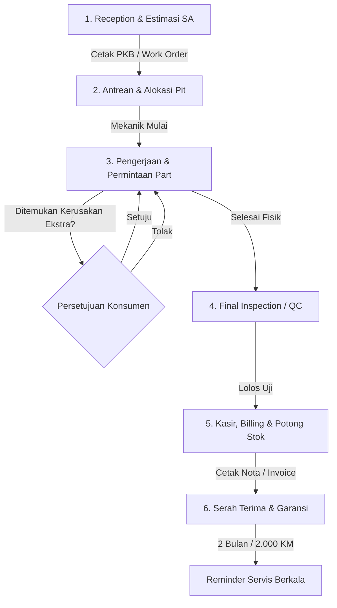

# Motorcycle Workshop (Bengkel Motor) Business Flow & SOP

Dokumen ini mendeskripsikan alur kerja operasional, Standar Operasional Prosedur (SOP), aturan bisnis (*business rules*), dan interaksi antarmodul dalam sistem **BengkelKu** yang diadopsi dari tata kelola bengkel motor profesional (AHASS, Yamaha SIP/Plaza, & bengkel modern).

---

## 1. Diagram Alur Operasional Utama (6-Stage End-to-End SOP)

---

## 2. Rincian Alur per Tahapan Operasional

### A. Tahap 1: Penerimaan (Reception) & Pembuatan PKB
* **Petugas**: *Service Advisor (SA)* / Frontdesk.
* **Prosedur**:
  1. Input identitas pelanggan (Nama, WhatsApp) & kendaraan (Nomor Polisi unik, Odometer/KM motor, level bensin).
  2. Diagnosa keluhan dan rekomendasi paket servis (Servis Ringan, Servis Lengkap, Ganti Oli, dll).
  3. Pembuatan dokumen **PKB (Perintah Kerja Bengkel) / Work Order (WO)** yang memuat rincian estimasi biaya dan estimasi waktu.

### B. Tahap 2: Alokasi Pit & Penugasan Mekanik
* **Petugas**: Kepala Bengkel / SA.
* **Prosedur**:
  1. Alokasi antrean motor ke *Pit* kerja berdasarkan urutan kedatangan atau jadwal reservasi.
  2. Penugasan teknisi yang sesuai. Status order: `MENUNGGU` ➔ `DIKERJAKAN`.

### C. Tahap 3: Pengerjaan & Permintaan Part (*Part Requisition*)
* **Petugas**: Mekanik, Petugas Gudang (*Partman*), SA.
* **Prosedur**:
  1. Mekanik melakukan pembongkaran dan servis sesuai item di PKB.
  2. **Rule Persetujuan Tambahan (*Approval*)**: Jika ditemukan sparepart aus lain di luar keluhan awal, SA **wajib meminta persetujuan konsumen** terlebih dahulu sebelum part dipasang.

### D. Tahap 4: Pemeriksaan Akhir (*Final Inspection / QC*)
* **Petugas**: Kepala Mekanik / SA.
* **Prosedur**:
  1. Pengujian fungsi kelistrikan, rem, respon gas, dan uji jalan (*test ride*).
  2. Mengumpulkan sparepart bekas/lama untuk diserahkan ke konsumen sebagai bukti fisik penggantian.
  3. Status order: `DIKERJAKAN` ➔ `SELESAI` (Siap Bayar).

### E. Tahap 5: Kasir, Billing & Pengurangan Stok Otomatis
* **Petugas**: Kasir.
* **Prosedur**:
  1. Pembuatan Invoice dari PKB (Total Jasa + Total Sparepart - Diskon).
  2. Penerimaan pembayaran (Tunai, Transfer Bank, QRIS, Piutang Armada).
  3. **Pengurangan Stok Otomatis (FIFO)** di database saat transaksi disimpan secara atomik.
  4. Cetak Invoice rangkap. Status transaksi: `LUNAS`.

### F. Tahap 6: Serah Terima & Garansi Servis
* **Petugas**: SA & Kasir.
* **Ketentuan Garansi**:
  - Servis Ringan / Rutin: 7 hari atau 500 km.
  - Servis Berat / Turun Mesin: 30 hari atau 1.000 km.
* **Reminder Servis**: Menjadwalkan pengingat servis otomatis untuk 2 bulan ke depan / +2.000 KM.

---

## 3. Matriks Aturan Bisnis (*Business Rules*)

1. **Aturan Nomor Polisi**: Nomor Polisi (`nopol`) motor wajib unik dan menjadi kunci pelacakan histori servis jangka panjang.
2. **Aturan Stok Sparepart**:
   - Transaksi kasir tidak boleh menghasilkan stok negatif (`qty <= stok_tersedia`).
   - Suku cadang dikelompokkan ke dalam *Fast Moving* (oli, kampas, busi) dan *Slow Moving* (piston, klep, shockbreaker).
   - Ketika stok mencapai batas minimum (*Reorder Point*), sistem memberikan notifikasi *Stok Menipis*.
3. **Aturan Komisi Mekanik**:
   - Komisi dihitung dari persentase bagi hasil jasa servis atau tarif flat per jenis pekerjaan.
   - Pengerjaan ulang atas klaim garansi tidak menghasilkan komisi baru.
