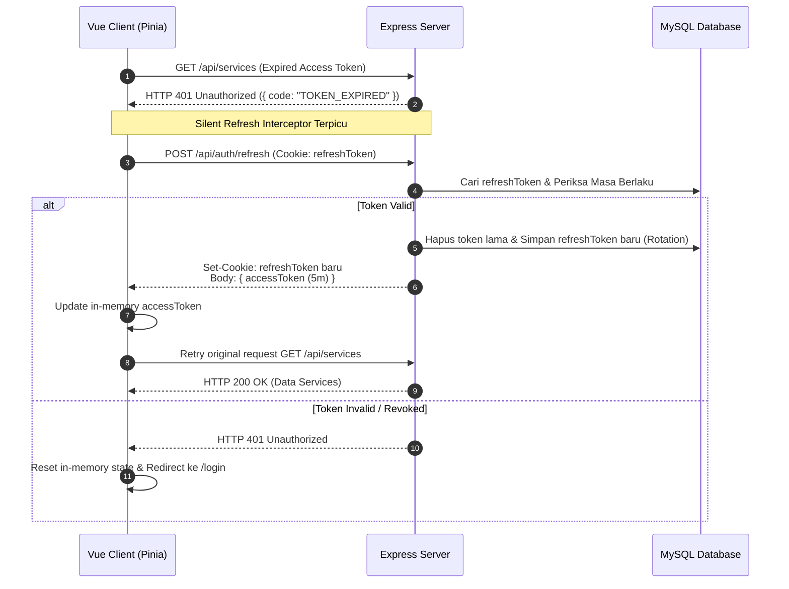

# 🔐 BengkelKu Security & Authentication Architecture

Dokumen ini memuat standar keamanan teknis, spesifikasi token JWT, rotasi refresh token, dan kebijakan otorisasi berbasis peran (RBAC) pada aplikasi BengkelKu.

---

## 1. Spesifikasi Token & Session Management

| Komponen | Spesifikasi | Tempat Penyimpanan | Masa Berlaku | Proteksi Keamanan |
| :--- | :--- | :--- | :--- | :--- |
| **Access Token** | JWT (HS256) signed with `ACCESS_TOKEN_SECRET` | **In-Memory** (Pinia Store) | **5 Menit** | Kebal dari XSS; hilang saat tab ditutup |
| **Refresh Token** | Cryptographic Random String (UUID/SHA256) | **Database** + **Cookie** | **7 Hari** | `httpOnly`, `Secure` (prod), `SameSite=Lax`, Path: `/api/auth` |

### Payload Access Token (JWT):
```json
{
  "sub": 1,
  "username": "admin",
  "nama": "Service Advisor & Admin",
  "role": "ADMIN",
  "mechanicId": null,
  "iat": 1755800000,
  "exp": 1755800300
}
```

---

## 2. Diagram Alur Silent Refresh & Rotasi Token



---

## 3. Matriks Otorisasi Endpoint API

| Endpoint | Method | Peran yang Diizinkan | Deskripsi & Pembatasan |
| :--- | :---: | :--- | :--- |
| `/api/auth/login` | POST | Publik | Autentikasi kredensial pengguna |
| `/api/auth/refresh` | POST | Publik (via Cookie) | Rotasi refresh token & generate token baru |
| `/api/auth/logout` | POST | Authenticated | Revoke refresh token & bersihkan cookie |
| `/api/auth/me` | GET | Authenticated | Profil user aktif |
| `/api/users/**` | ALL | `KEPALA_BENGKEL` | CRUD Akun Pengguna & Reset Password |
| `/api/services` | GET | Authenticated | **Scoped**: Jika `MEKANIK`, hanya melihat servis miliknya |
| `/api/services` | POST/PUT | `ADMIN` | Pembuatan PKB & Alokasi Mekanik |
| `/api/services/:id/items` | ALL | `ADMIN`, `MEKANIK` | Mekanik hanya untuk PKB yang sedang dikerjakannya |
| `/api/mechanics` | GET | Authenticated | List teknisi mekanik |
| `/api/mechanics` | POST/PUT/DEL | `KEPALA_BENGKEL`, `ADMIN` | Manajemen data teknisi |
| `/api/transactions` | POST | `ADMIN` | Pembuatan invoice & pembayaran kasir |
| `/api/transactions` | GET | `ADMIN`, `KEPALA_BENGKEL` | Rekap transaksi |
| `/api/master/**` | GET | Authenticated | List katalog suku cadang & jasa |
| `/api/master/**` | POST/PUT/DEL | `ADMIN` | Perubahan katalog & stok masuk |

---

## 4. OWASP Top 10 Hardening Checklist

- [x] **XSS Prevention**: Access token tidak disimpan di `localStorage`.
- [x] **CSRF Mitigation**: Refresh token menggunakan cookie `SameSite=Lax` + RESTful stateless headers untuk API data.
- [x] **Password Hashing**: Menggunakan `bcryptjs` dengan *salt rounds* 10.
- [x] **Brute Force Protection**: Rate limiting pada `/api/auth/login` (5 attempt / 15 menit).
- [x] **SQL / ORM Injection**: Seluruh query menggunakan parameterized queries melalui Prisma ORM.
- [x] **Defense-in-Depth Validation**: Skema input divalidasi ketat dengan Zod sebelum menyentuh service layer.
